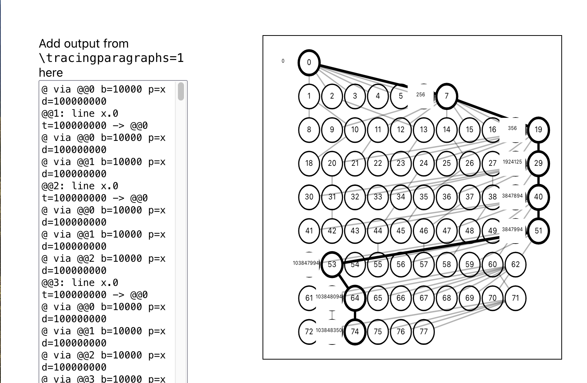

# TeX Tools

[tex-tools.xymoste.ch](https://tex-tools.xymoste.ch/)

This is just some basic tools I created to help me debug
[XymosTeX](https://github.com/xymostech/XymosTeX). Some of them can be used to
understand TeX more broadly, some might be XymosTeX specific.

I'm using D3 for many of the tools, but it's my first time really using D3.

# License

These tools are licensed under the [MIT License](LICENSE)